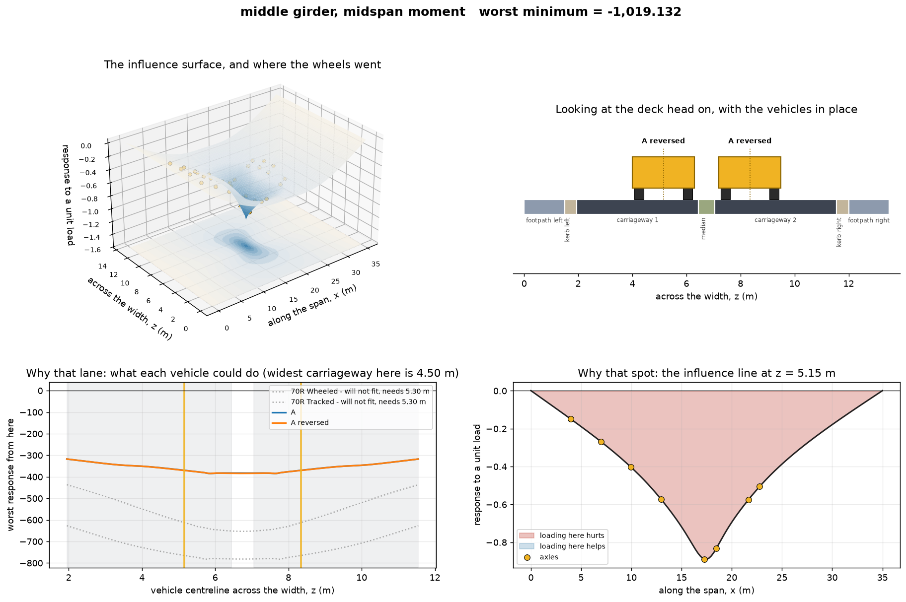

# setu

Finds the worst legal position of the IRC:6 vehicles on a bridge deck, and the
response they cause.

The usual way to answer that is to move the vehicles, analyse, move them again,
and analyse again — tens of thousands of analyses for one bridge. setu does it
with **one analysis per response quantity**, and returns the exact worst
position rather than the best of whatever positions happened to be tried.

```python
from setu import DeckCrossSection, InfluenceSolver, find_critical_position
from setu.bridge_model import build_bridge_model

model = build_bridge_model(BRIDGE)

influence = InfluenceSolver(model.as_deck_model())
surface = influence.for_girder_moment("middle girder, midspan", element)

worst = find_critical_position(surface, CROSS_SECTION, span_m=35.0)
print(worst.describe())
```

```
middle girder, midspan moment  [minimum]
------------------------------------------------------------------------
  Design response          =      -1035.573
  Before lane reduction    =      -1035.573
  Lane reduction (Table 8) =          1.000   on 2 lanes
  Residual UDL (Table 6 S.No.1) applied beside the vehicles
  Arrangement              = class_a | class_a
  Carriageways read as     = separate

  vehicle                      z (m)      x (m)   impact  train
  Class_A_reversed             5.150      4.200   1.1856  1 at [4.200]
  Class_A_reversed             8.350      4.200   1.1856  1 at [4.200]
------------------------------------------------------------------------
```

---

## How it works

**One solve instead of thousands.** For a linear model the response `R` to a
load `f` is `R = aᵀK⁻¹f`, and because `K` is symmetric that equals `(K⁻¹a)ᵀf`.
So solving the model *once* with `a` applied as an imaginary load gives a
deflected shape whose ordinate at every node is the response to a unit load at
that node. That shape is the influence surface. Every vehicle position
afterwards costs an interpolation instead of an analysis.

**Two exact searches** then find the worst position the code actually allows.

*Along the span*, a lane may carry several vehicles nose to tail. Finding the
worst train is not a matter of putting each vehicle at its own worst spot,
because the code sets a minimum gap between them. A dynamic program reads the
positions in order: the best train of `k` vehicles ending at a position is that
position's response plus the best train of `k−1` ending far enough behind it.

*Across the width*, every lane carries a vehicle at once and all of them must
be positioned together. Push the arrangement fully left, then let each block
slide right — two blocks keep their clearance exactly when the left one does not
slide further than the right one. Every clearance rule in Table 3 collapses into
one: the sliding amounts never decrease left to right. That makes it a second
dynamic program.

Both are **exact, not sampled**: the positions tried include every point at
which a response curve can bend, and between those points the total is linear.

---

## What it covers

| | |
|---|---|
| Clause 204.1 | Class A, Class 70R Wheeled, Class 70R Tracked |
| Clause 204.1.4 | vehicles heading either way — Class A is not symmetric |
| Clause 204.2 | load dispersing at 45° through the wearing course |
| Clause 204.3, Table 3 | kerb clearance, gaps between vehicles, 70R zones |
| Table 6 | design lanes from carriageway width |
| Table 6A | which vehicles may share a carriageway, and note (b) — partly loaded cases |
| combination drawings | all thirteen carriageway-width bands, case for case |
| Table 6 S.No.1 | the 500 kg/m² residual load, moving with the vehicle |
| Clause 205, Table 8 | reduction for several lanes loaded together |
| Clause 206 | footway and cycle track loading |
| Clause 208 | impact, per vehicle and per member (208.5) |

Uniform loads are placed on the adverse area only — a uniform load may stand
anywhere, so the worst case stands only where it hurts.

Both transverse conditions are answered: the swept position, and the position
with the load resultant on the carriageway centreline. The second can never
govern — it is one position inside the set the sweep searches — so it is
reported beside the answer, with the gap between them.

### The combination drawings

The standard drawings define thirteen carriageway-width bands and the cases
permitted in each. setu reproduces every one of them, and every band boundary
follows from the same handful of numbers:

| boundary | from |
|---|---|
| 5.30 m | a lone 70R: 2.90 wide, 1.20 clear either side |
| 9.70 m | 0.15 kerb + 2.30 Class A + **7.25 70R zone at a kerb** |
| 13.20 m | 0.15 + 2.30 + 1.20 gap + 2.30 + 7.25 |
| 14.50 m | 7.25 + 7.25 |
| 16.70 m | 0.15 + 2.30 + **7.00 70R zone between lanes** + 7.25 |
| 16.80 m | 7.25 + 2.30 + 7.25 |
| 20.30 m | 7.25 + 2.30 + 1.20 + 2.30 + 7.25 |

Two placement rules come from the drawings rather than from any table, and both
are enforced by default:

- a 70R always reaches a kerb, stepping only through other 70R zones — never
  boxed in behind a lane of Class A
- never more than two 70R on one carriageway

The second is inferred: six lanes would hold three, and 21.50 m is wide enough,
but the drawings stop at two and there is no band boundary at 21.50 m where a
third would first fit. Every other case has one.

`follow_combination_drawings=False` lifts both and searches every arrangement
the geometry permits, which can only be more adverse.

---

## Seeing it

```bash
uv sync --extra plot
uv run python examples/draw_the_answer.py
```

Four panels that together explain one answer: the influence surface as the deck
shape it really is with the wheels sitting on it; the deck head on with the
vehicles in place; what each vehicle could do from every position across the
width, with the ones that will not fit drawn dotted and labelled; and the
influence line along the span with every axle marked where it stopped.



It also writes an animation of the governing vehicle driving across the deck,
tracing what it causes from each position — the trace bottoms out exactly where
the search put it.

---

## Install

```bash
uv sync --extra dev     # everything, including the solver and the tests
uv sync --extra plot    # + matplotlib, for the drawings
uv sync                 # just the library (numpy only)
```

Python 3.11 or newer. `import setu` does **not** pull in a finite element
solver, so the code rules and both searches can be used, and tested, without
one.

---

## Layout

Folders are named for the work they do.

```
src/setu/
    bridge_model/          builds the deck in the solver, and its own weight
    irc_code_rules/        the IRC:6 rules — vehicles, tables, lanes, impact
    influence_surfaces/    one solve per response quantity, and the beam stiffness
    vehicle_placement/     the two searches
    drawings/              the pictures (matplotlib, imported only when used)
    critical_position.py   the entry point that ties them together
```

`openseespy` is imported in exactly one file, behind a five-method protocol
(`influence_surfaces/fe_backend.py`). Swapping in another solver means writing
one class against it - the protocol's comments say what each method has to
promise, and the one that matters most is that a backend must be safe to call
again and again, because a solve that leaks state into the next one gives wrong
answers everywhere downstream, silently.

---

## Running it

```bash
uv run pytest                              # 722 tests
uv run python examples/plate_girder_35m.py # a 35 m bridge, end to end
uv run ruff check src tests examples
uv run mypy
```

---

## Verification

The searches are checked two ways.

**Against exhaustive enumeration**, in `tests/oracles.py` — every legal train
and every legal sliding chain tried one by one. The dynamic programs must agree
with the slow answer, and the placements they return must respect every
clearance.

**Against the finite element model itself** — `tests/test_end_to_end.py` puts a
real unit load on the deck, solves, reads the girder moment straight off the
element, and checks it against the influence ordinate. On the worked example
the two agree to twelve significant figures.

The whole bridge is also checked to carry exactly its own weight, with nothing
leaking sideways.
