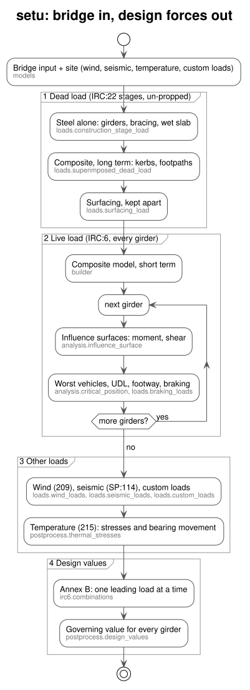

# Setu

Bridge analysis library for IRC:6 plate girder design. Uses influence surfaces
and the adjoint method to find the worst legal vehicle position without brute-force
FEA — one solve gives the response everywhere on the deck.

Built as the analysis backend for [OsdagBridge](https://github.com/osdag-admin/OsdagBridge)

## Install

Requires Python 3.12+ and [uv](https://docs.astral.sh/uv/).

```bash
uv sync
```

## Usage

```python
from setu import (
    BridgeInput, DeckCrossSection, DeckSlab, Girders, Bracing,
    MeshSettings, PlateGirderSection,
)
from setu.models.site import SeismicSite, TemperatureSite, WindSite
from setu.postprocess.design_values import girder_design_values
from setu.utils.constants import BASIC, BIGGER_IS_WORSE, MIDSPAN_MOMENT, PLAIN_TERRAIN

bridge = BridgeInput(
    span_m=35.0,
    cross_section=DeckCrossSection.from_widths({
        "footpath_left": 1.5,
        "carriageway": 7.5,
        "footpath_right": 1.5,
    }),
    deck=DeckSlab(thickness_m=0.23, overhang_m=1.25, wearing_course_thickness_m=0.075),
    girders=Girders(count=4, section=PlateGirderSection(
        top_flange_width_m=0.55, top_flange_thickness_m=0.025,
        bottom_flange_width_m=0.65, bottom_flange_thickness_m=0.04,
        web_height_m=2.1, web_thickness_m=0.014,
    )),
    bracing=Bracing(station_count=7, area_m2=0.01, arrangement="XT"),
    mesh=MeshSettings(panels_between_braces=4, target_size_across_width_m=0.6),
)  # un-propped construction by default; pass construction="propped" to change it

results = girder_design_values(
    bridge,
    wind=WindSite(basic_wind_speed_mps=39.0, terrain=PLAIN_TERRAIN, height_m=12.0, solid_barrier_height_m=1.1),
    seismic=SeismicSite(zone="IV", soil="II"),
    temperature=TemperatureSite(shade_max_c=45.0, shade_min_c=2.0),
)
for girder, by_response in results.girders.items():
    governing = by_response[MIDSPAN_MOMENT][BASIC][BIGGER_IS_WORSE]
    print(f"girder {girder}: {governing.value:.1f} kNm ({governing.combination})")
```

## Command line

One command runs the whole analysis on a bridge file and writes everything to `analysis_results/`:

```bash
uv run python cli.py examples/bridge.toml          # add --plot to pop up the plots
```

- `analysis_results/result.json` contains:
  - every critical position (each girder; midspan moment and support shear; both directions), each with:
    - the vehicles, and every wheel with its x, z, load, impact and lane reduction, so it can be placed in MIDAS as static loads;
    - the lanes, residual UDL and footway strips;
    - the same load solved in OpenSees as a check;
  - the design values for every girder and limit state, plus the governing ones;
  - the dead load by construction stage;
  - the wind, seismic and temperature numbers.
- `analysis_results/plots/` holds the design dashboard and the critical position of every girder.
- To write the bridge file, open `examples/form.html` in a browser: fill it in, download `bridge.toml`. The TOML format is shown in `examples/bridge.toml`.

The CLI only calls setu's public API. OsdagBridge uses setu as a library.

## Structure

Each folder is one layer. A layer only imports from the layers above it.

```text
setu/
├── models/       bridge inputs: geometry, deck, materials, sections
├── irc6/         IRC:6 rules: vehicles, impact, lanes, wheel loads, combinations; irc_constants.py holds the clause values
├── builder/      mesh generation and OpenSees model assembly
├── loads/        dead loads in construction stages, live load, load cases
├── solver/       OpenSees FE backend and stiffness matrices
├── analysis/     influence surfaces, along-span and across-carriageway search, critical position
├── postprocess/  girder response, dead load by stage, envelopes, result datasets, plots
└── utils/        constants.py: constants more than one module uses
```

## Flow



- **Dead load** is solved in the IRC:22 construction stages: bare steel for the wet slab when un-propped, then the long-term composite deck (m ≥ 15) for everything laid on it. Surfacing is kept apart, because IRC:6 Table B.2 factors it at 1.75 rather than 1.35.
- **Live load** uses the short-term composite deck (m ≥ 7.5). Each girder gets its own influence surfaces (composite moment and shear) and its own critical-position search, including the residual UDL and the clause 206.3 footway load. Braking (211) goes with the traffic it comes from.
- **Wind** follows IRC:6 clause 209: Table 12 pressure, F_T at the centroid of its area, F_L, F_V, and wind on the live load.
- **Seismic** follows IRC:SP:114-2018, which replaced IRC:6 clause 218: Ah = (Z/2)(I/R)(Sa/g) with the Table 5.2 minimum, 20 % live load, and the 100/30/30 combination.
- **Temperature** (215) gives no girder force on a simply supported span with a free bearing. It is reported as the Fig. 16b primary stresses and the bearing movement instead. Fig. 16b does not give the reverse profile's depths, so pass them yourself if you need it.
- **Custom loads**: point, line or area loads filed under DL / SIDL / DW / LL / EL / WL / TL, or a group of your own that only a custom combination picks up.
- **Combinations** follow IRC:6 Annex B. One variable load leads at a time; a variable load that relieves the effect is left out; permanent loads take their adding or relieving factor; no live load in winds over 36 m/s.
- Every force is an internal force, sagging positive.

## Tests

```bash
uv run pytest
```
