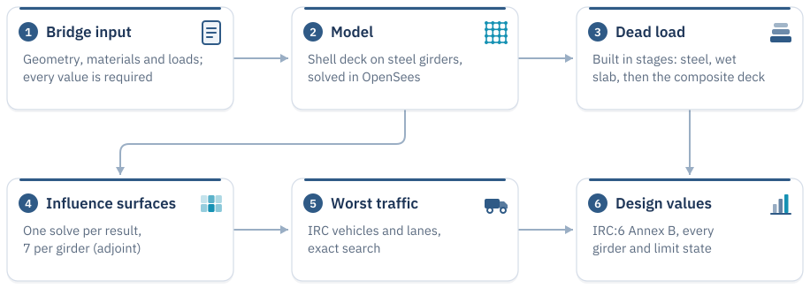

<p align="center">
  <picture>
    <source media="(prefers-color-scheme: dark)" srcset="docs/assets/logo-dark.svg">
    
  </picture>
</p>

Bridge analysis library for IRC:6 plate girder design. Uses influence surfaces
and the adjoint method to find the worst legal vehicle position without brute-force
FEA — one solve gives the response everywhere on the deck.

Built as the analysis backend for [OsdagBridge](https://github.com/osdag-admin/OsdagBridge).

## Install

Requires Python 3.12+ and [uv](https://docs.astral.sh/uv/).

```bash
uv sync
```

## Usage

```python
from setu import girder_design_values
from setu.utils.constants import BASIC, BIGGER_IS_WORSE, MAX_MOMENT

results = girder_design_values(bridge)          # bridge = BridgeInput(...), see the docs
for girder, by_response in results.girders.items():
    print(girder, by_response[MAX_MOMENT][BASIC][BIGGER_IS_WORSE].value)
```

Or in a local web app:

```bash
uv run --with flask python web/app.py             # then open http://localhost:5000
```

## How it works

<picture>
  <source media="(prefers-color-scheme: dark)" srcset="docs/assets/diagrams/flow-dark.svg">
  
</picture>

## Documentation

```bash
uv run --with mkdocs-material --with "mkdocs<2" mkdocs serve   # then open http://127.0.0.1:8000
```

## Structure

```text
setu/
├── models/       bridge inputs: geometry, materials, sections
├── irc6/         IRC:6 rules: vehicles, impact, lanes, combinations
├── builder/      mesh and OpenSees model
├── loads/        dead, live and other load cases
├── solver/       OpenSees backend
├── analysis/     influence surfaces and critical position search
├── postprocess/  girder response and design values
└── utils/        shared constants
```

## Tests

```bash
uv run pytest
```
