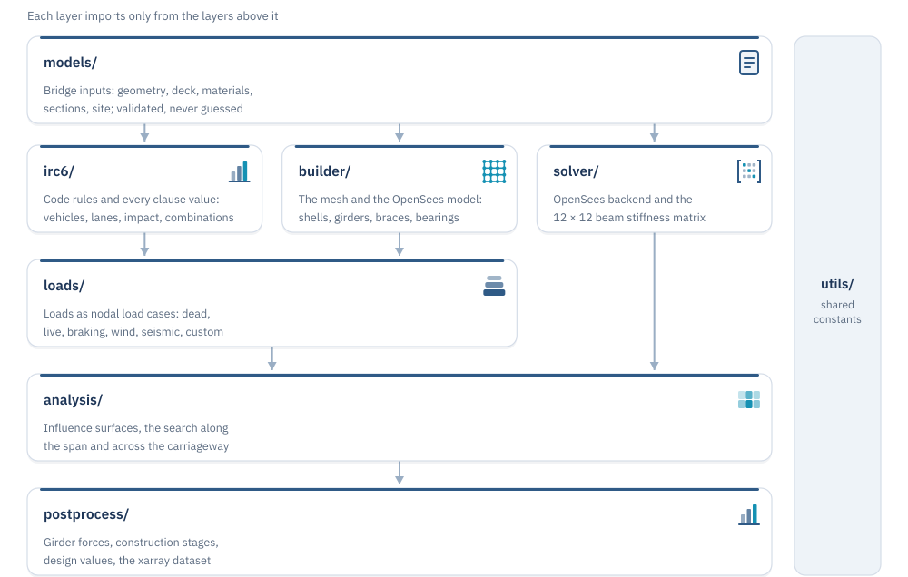
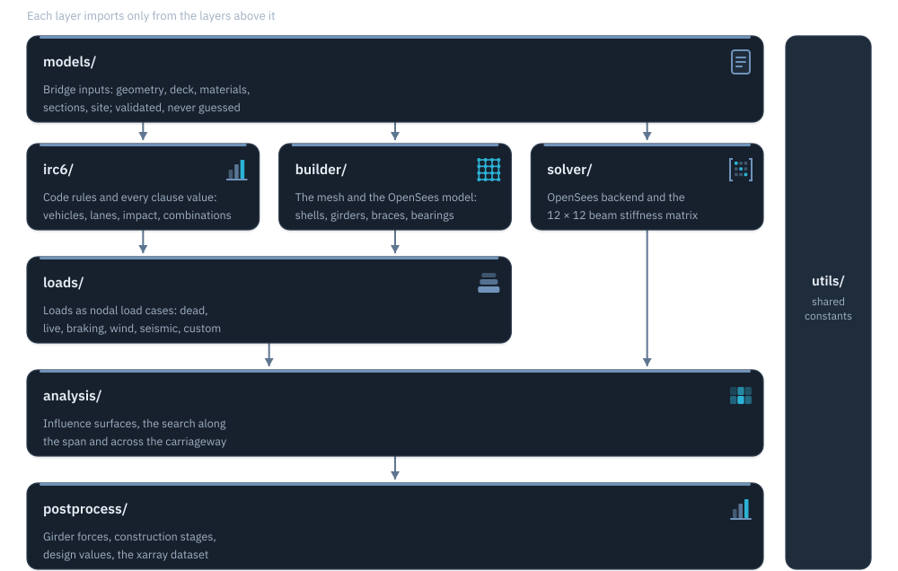

# Theory and package design

This part of the documentation is the technical manual. It explains **exactly what Setu computes and how**, down to the algorithm and the module that does it, so an engineer can check it and a developer can change it. If you want the ideas first, read [How it works](../how-it-works/index.md).

| Page | What it covers |
|---|---|
| [The structural model](model.md) | Elements, coordinates, levels, rigid links, bearings, section properties, modular ratio, skew. |
| [Meshing](mesh.md) | How stations along and across the deck are chosen. |
| [Influence surfaces](influence.md) | The adjoint derivation, what each surface is, bilinear reading, reciprocity for other load cases. |
| [Search along the span](along-span.md) | Why only wheel-over-station positions need checking; trains by dynamic programming; impact. |
| [Search across the carriageway](across.md) | Lane patterns from Table 6/6A, packing and sliding, dynamic programming over blocks, lane reduction, UDL and footway. |
| [Design values](design-values.md) | Places, effects, Annex B combinations, deflection, fatigue, braking, wind, seismic, temperature. |
| [Verification](verification.md) | How Setu checks itself, and what the tests prove. |

## Package design

Setu is a set of layers. Each layer only imports from the layers above it, so the rules of the code (in `irc6/`) never depend on how the model is solved.

{ .only-light .diagram }
{ .only-dark .diagram }

| Layer | Owns |
|---|---|
| `models/` | Plain input objects. They validate what they are given and never guess. |
| `irc6/` | Code rules and every clause value (`irc_constants.py`), with the clause next to each number. |
| `builder/` | The mesh and the OpenSees model. |
| `loads/` | Turning loads into nodal load cases. |
| `solver/` | The OpenSees backend and the 12 × 12 beam stiffness matrix. |
| `analysis/` | Influence surfaces and the critical position search. |
| `postprocess/` | Girder forces, construction stages, design values, datasets. |
| `utils/constants.py` | Names and conventions shared by several layers. |

## Principles

- **No fallbacks.** Every input is required. A missing value raises an error that names it; Setu never substitutes a "typical" value.
- **Units in names.** `span_m`, `elastic_modulus_mpa`, `footpath_kpa`. Inside, everything is kN and m. The only conversion of E happens in one place (`Steel` / `Concrete.elastic_modulus_kpa`).
- **Follow the code text.** Where another program differs from the IRC text, Setu follows the text.
- **Internal forces, sagging positive.** Deflection is positive downward. x runs along the span from the first bearing, z across the deck from the left edge, y up.
- **Exact where possible.** The search evaluates the positions where the answer can change, not a grid with a step size (see [Search along the span](along-span.md)).
